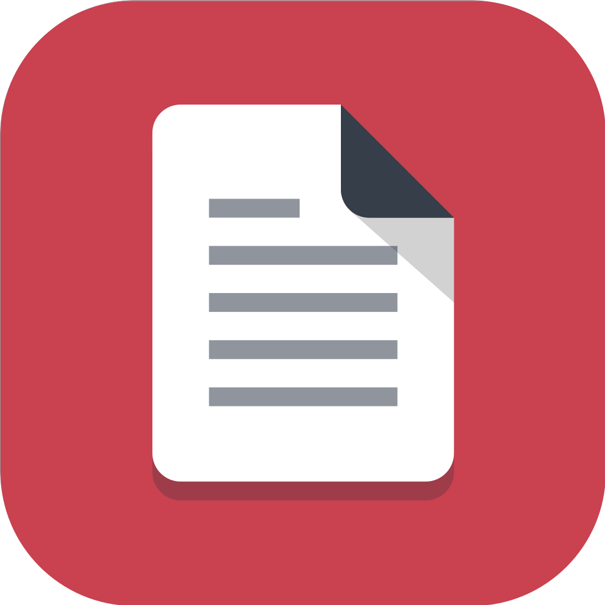

# Hi, I'm Julian! 👋

- 🔭 I’m currently working on ... 🤫
- 🌱 I’m currently learning `Domain Driven Design` and `Test Driven Development`
- 👯 I’m looking to collaborate on `Open Source projects`
- 🤔 I’m looking for help with the design at [PDF Archiver](https://pdf-archiver.io)
- 📫 How to reach me: [Web](https://juliankahnert.de) | [Twitter](https://twitter.com/JulianKahnert) | [Mail](mailto:mail@juliankahnert.de)

## :octocat: My projects:

<b>PDF Archiver (iOS, iPadOS, macOS</b>

 

 

I started this project in 2017 with the macOS App and put a lot of heart and soul into it. 🙄
Friends of mine and I 👨🏻‍💻 have been looking for a way to digitally sort documents so that they can be easily retrieved. 🕵🏻 We didn't want to use a cloud service where our documents would disappear into any database. We wanted a concept where as much information as possible could be stored in the file name. 💾 This is how we defined the following naming scheme:

`2019-07-04--blue-pullover__clothing_invoice.pdf`

It contains a date, a description and tags. Everything together forms the file name, which can be easily searched on various operating systems.
To make this sorting as easy as possible I brought PDF Archiver to the iPhone. Here documents can be scanned and then automatically analyzed. 🤯 The intelligent text recognition takes place exclusively on your device, so no private information leaves your device! 🔒

PDF Archiver is intended as a tool for your personal document workflow. So if you saved some time archiving your documents, or if there was a moment when you were happy to have all your documents on your iPhone, feel free to write a short comment on the App Store. 🖋

Made with 💚 and 🙇🏻‍♂️ in Oldenburg, Germany.

## I like building things with:

![Vapor](https://img.shields.io/badge/-Vapor-black?color=blueviolet&style=for-the-badge&logo=data:image/png;base64,iVBORw0KGgoAAAANSUhEUgAAAB0AAAAgCAIAAABhFeQrAAAABGdBTUEAALGPC/xhBQAAAHhlWElmTU0AKgAAAAgABQESAAMAAAABAAEAAAEaAAUAAAABAAAASgEbAAUAAAABAAAAUgEoAAMAAAABAAIAAIdpAAQAAAABAAAAWgAAAAAAAAAZAAAAAQAAABkAAAABAAKgAgAEAAAAAQAAAB2gAwAEAAAAAQAAACAAAAAAdzil7wAAAAlwSFlzAAAD2AAAA9gBbkdjNQAAAjhpVFh0WE1MOmNvbS5hZG9iZS54bXAAAAAAADx4OnhtcG1ldGEgeG1sbnM6eD0iYWRvYmU6bnM6bWV0YS8iIHg6eG1wdGs9IlhNUCBDb3JlIDYuMC4wIj4KICAgPHJkZjpSREYgeG1sbnM6cmRmPSJodHRwOi8vd3d3LnczLm9yZy8xOTk5LzAyLzIyLXJkZi1zeW50YXgtbnMjIj4KICAgICAgPHJkZjpEZXNjcmlwdGlvbiByZGY6YWJvdXQ9IiIKICAgICAgICAgICAgeG1sbnM6ZXhpZj0iaHR0cDovL25zLmFkb2JlLmNvbS9leGlmLzEuMC8iCiAgICAgICAgICAgIHhtbG5zOnRpZmY9Imh0dHA6Ly9ucy5hZG9iZS5jb20vdGlmZi8xLjAvIj4KICAgICAgICAgPGV4aWY6UGl4ZWxZRGltZW5zaW9uPjk2PC9leGlmOlBpeGVsWURpbWVuc2lvbj4KICAgICAgICAgPGV4aWY6UGl4ZWxYRGltZW5zaW9uPjg2PC9leGlmOlBpeGVsWERpbWVuc2lvbj4KICAgICAgICAgPHRpZmY6T3JpZW50YXRpb24+MTwvdGlmZjpPcmllbnRhdGlvbj4KICAgICAgICAgPHRpZmY6UmVzb2x1dGlvblVuaXQ+MjwvdGlmZjpSZXNvbHV0aW9uVW5pdD4KICAgICAgPC9yZGY6RGVzY3JpcHRpb24+CiAgIDwvcmRmOlJERj4KPC94OnhtcG1ldGE+CualocoAAAWQSURBVEgNjVVbbFRFGP5nzmX3nL11L6f3llJYKgUxQUmUWiMIVoo0gcKTDyYkokJAMSElQdAYEoMh0RRpsfKCTyS8UBsQI5ISRMAqmIKtlVqwpez2srvdbfd+zhnn7Dbt7vZAOw8nc/7555tvvvn+GfTFikFYQHMu41xutu9CdAG5Wgq7kLzi5/n6o05bEWNfFLp1KkTU+SfheVOWN4iNJyR7GYtZVLvbtvm4U3DMP2uejBd3W+s/cxits2nLXxd3tEn5K7inE5qdkJPHm9Gmzx2UIKWZM1TwDL+9VaraLOTEM3+Zjfn7M//TfVsZs+W4071OnDuUjvACdq8TsAEe/R4HopOlw5ee0o62/PIXjDrpGSG6j7Xv2LZ86RQlHZBcP9BT2nDQnhZ0fHxclmVTqmGsM5muUrVedJRzl474vd2JjEUzfYbgpd3WtbtsmJlOaGlpOXnypNlsdjgcpaWlVVVVa9asqampKSwszISQlnLbW6QrxwM95yMzcZSuC86ENhy2r3zTNDNAOx0dHQ0NDZkR2qeg+/bta2pqytkBNfWtM6HrzSE1mdKb4n6z6fF/XVEyp3k8HkmScnDTv62trXPStcD9q5GW9cMa12/f904MRnSTaHAu3zRudXV1OBzWnTU6GDn7lhf/uLPgjvmJTmxsbNTlOzw87PP5dIdsA8LLcRf2xuDIX3DqIST0qr6+vr6kpGTu/LRJcuIkAYFTquewLHsBiyn/nBmCQ70wEs/JBJfLtWfPntwowNatW6lJMuPyCIweUoJnVECARMLUffApPb+EAg+icMMPlSIUZRfE6tWr+/r6ent7Z1Dq6uqam5tFcbYaY7fJ2GElfheQARgJ2AqE9nYTWv++BHjiEFNAZGDXItiRvfVkMtne3t7Z2akoSm1t7bZt24zG2cVD59RAm0oigIzAFiPGBbSy0YF7JKoCg2BKhqEoRBRQCWwugL2VYMktxhnG0x11EvwnlKkLBDBgE7BlCFsAFEACoNMPCWVKlaU6U0cPR2FC1s5wpQWa3LA0q1CycBP9xHdMjd8ldO84TwNF9O5UgS0AtgjQd16iJmA8AY+iIFP+oK0xGoe4Ck4ePqyE1/QqI/Iz8X2lKL6UoBSoEGl7Zyg6ME7EY8y88epBtog1sWBhIJJiamPBiCGmwqQM1/wa9+esmlDpRpIwcVoNfK2qEWom4MoRk4/o3qkOXCXi8hgOI+/jOPNK97tqVOWfNQoCsjGaFGEVBAYsnIZIWd8OQn8YVtnAzII8QnxH1anvCcLAWIFbjLBZE5RxAleBDCYMCum6Eeq8GGA2SvvlnkTynzi3wiC4sAVp1ChT+krYOZqmrTQQgRshWDpEmE/UKPUPNZNLA0Kpg2VLgCtFohFPBZXLF/09d2h9w/R7oXiU2K9RXMYaKzgz0vhSeygAeZy2QFyBEQDhIlnVRRQR2FLEFqUE5YFfDKyERQ4PPYhdavd5H03fwrNWUkeUiY99yZ1Wc6PVIWgSD0YhKIPEa8v0UwUxIBPwSxCiZpIBUx0WIU7AiJA/fgvd7AzJ6RsydQ6zuNqvTMJtQXkgaX0vz+xglmAYjmneMDGwhAdrHuLcKEGrTEmZqRgZDTgaUX65Evy7O5w+1ZlvNm4qHL8c8T9M2j5yCNV8OdIqkNYLh8BmB0LTkaYs60QChzyeROelwOjjrBcoDa3/ain9yUDT2OQPYYaHfCMsM2lSKFQKAXg38BI2sKjnXrjj7JguKIXW4ZtekEyqoWN+eSBheTvPKiA3B3ZqJjc1FpYT5Nr1iT9vTmrkn9CeiJvOj5ybSlJN9jrMFazNhoQgGg0kr/40MfRv7CmgdK6+Dpkkkl3xwIHR8K2owQgD92Pnz46lQDNTdPrT77HOSHaIGFFxjWnsaliml8gC2v/cnmmHODJjjgAAAABJRU5ErkJggg==)
![SwiftPM](https://img.shields.io/badge/-SwiftPM-black?style=for-the-badge&logo=data:image/svg+xml;base64,PHN2ZyB3aWR0aD0iMTgyIiBoZWlnaHQ9IjE4MiIgdmlld0JveD0iMCAwIDE4MiAxODIiIHhtbG5zPSJodHRwOi8vd3d3LnczLm9yZy8yMDAwL3N2ZyI+PHRpdGxlPkxvZ28gU21hbGw8L3RpdGxlPjxkZWZzPjxsaW5lYXJHcmFkaWVudCB4MT0iMTAwJSIgeTE9IjAlIiB4Mj0iMCUiIHkyPSIxMDAlIiBpZD0iYSI+PHN0b3Agc3RvcC1jb2xvcj0iI0Y4OEEzNiIgb2Zmc2V0PSIwJSIvPjxzdG9wIHN0b3AtY29sb3I9IiNGRDIwMjAiIG9mZnNldD0iMTAwJSIvPjwvbGluZWFyR3JhZGllbnQ+PGxpbmVhckdyYWRpZW50IHgxPSI1MCUiIHkxPSIwJSIgeDI9IjUwJSIgeTI9IjEwMCUiIGlkPSJiIj48c3RvcCBzdG9wLWNvbG9yPSIjRjg4QTM2IiBvZmZzZXQ9IjAlIi8+PHN0b3Agc3RvcC1jb2xvcj0iI0ZEMjAyMCIgb2Zmc2V0PSIxMDAlIi8+PC9saW5lYXJHcmFkaWVudD48L2RlZnM+PGcgZmlsbD0ibm9uZSIgZmlsbC1ydWxlPSJldmVub2RkIj48cGF0aCBzdHJva2U9InVybCgjYSkiIHN0cm9rZS13aWR0aD0iNSIgZmlsbD0iI0ZERkFGQSIgdHJhbnNmb3JtPSJyb3RhdGUoNzUgOTAuNTEgOTAuNTEpIiBkPSJNMjkuMDEgMjkuMDFoMTIzdjEyM2gtMTIzeiIvPjxwYXRoIHN0cm9rZT0idXJsKCNhKSIgc3Ryb2tlLXdpZHRoPSI1IiBmaWxsPSIjRkRGQUZBIiB0cmFuc2Zvcm09InJvdGF0ZSg2MCA5MC41MSA5MC41MSkiIGQ9Ik0yOS4wMSAyOS4wMWgxMjN2MTIzaC0xMjN6Ii8+PHBhdGggc3Ryb2tlPSJ1cmwoI2EpIiBzdHJva2Utd2lkdGg9IjUiIGZpbGw9IiNGREZBRkEiIHRyYW5zZm9ybT0icm90YXRlKDQ1IDkwLjUxIDkwLjUxKSIgZD0iTTI5LjAxIDI5LjAxaDEyM3YxMjNoLTEyM3oiLz48cGF0aCBzdHJva2U9InVybCgjYSkiIHN0cm9rZS13aWR0aD0iNSIgZmlsbD0iI0ZERkFGQSIgdHJhbnNmb3JtPSJyb3RhdGUoMzAgOTAuNTEgOTAuNTEpIiBkPSJNMjkuMDEgMjkuMDFoMTIzdjEyM2gtMTIzeiIvPjxwYXRoIHN0cm9rZT0idXJsKCNhKSIgc3Ryb2tlLXdpZHRoPSI1IiBmaWxsPSIjRkRGQUZBIiB0cmFuc2Zvcm09InJvdGF0ZSgxNSA5MC41MSA5MC41MSkiIGQ9Ik0yOS4wMSAyOS4wMWgxMjN2MTIzaC0xMjN6Ii8+PHBhdGggc3Ryb2tlPSJ1cmwoI2EpIiBzdHJva2Utd2lkdGg9IjUiIGZpbGw9IiNGREZBRkEiIGQ9Ik0yOS4wMSAyOS4wMWgxMjN2MTIzaC0xMjN6Ii8+PHBhdGggZD0iTTExMy4xNjYgMTI0LjkxMWMtMTEuNDI2IDYuNjgzLTI3LjEzNiA3LjM3LTQyLjk0Mi41MTFDNTcuNDI2IDExOS45MSA0Ni44MDcgMTEwLjI2IDQwIDk5LjIzNWMzLjI2NyAyLjc1NiA3LjA4IDQuOTYyIDExLjE2NCA2Ljg5IDE2LjMyMyA3Ljc0NyAzMi42NDIgNy4yMTYgNDQuMTI3LjAyYS4xMDYuMTA2IDAgMDEtLjAxNy0uMDJjLTE2LjMzNy0xMi42OC0zMC4yMjQtMjkuMjItNDAuNTctNDIuNzI2LTIuMTgtMi4yMDYtMy44MTMtNC45NjItNS40NDctNy40NDNDNjEuNzgyIDY3LjUzNCA4MS42NiA4Mi4xNDMgODguNzM3IDg2LjI4IDczLjc2NSA3MC4yOSA2MC40MjIgNTAuNDQzIDYwLjk2NiA1MC45OTRjMjMuNjg5IDI0LjI1OCA0NS43NDUgMzguMDQyIDQ1Ljc0NSAzOC4wNDIuNzMuNDE2IDEuMjkzLjc2MyAxLjc0NiAxLjA3My40NzctMS4yMy44OTYtMi41MDYgMS4yNDgtMy44MyAzLjgxMi0xNC4wNTgtLjU0My0zMC4wNDgtMTAuMDc0LTQzLjI3OSAyMi4wNTQgMTMuNTA3IDM1LjEyNSAzOC44NjggMjkuNjc4IDYwLjA5NWEzNi40MjUgMzYuNDI1IDAgMDEtLjQ2MyAxLjY5M2MuMDY0LjA3Ni4xMjcuMTU2LjE5LjIzOCAxMC44OSAxMy43ODMgNy44OTcgMjguMzkyIDYuNTM1IDI1LjYzNi01LjkwNy0xMS43MDQtMTYuODQ0LTguMTI1LTIyLjQwNC01Ljc1eiIgZmlsbD0idXJsKCNiKSIgZmlsbC1ydWxlPSJub256ZXJvIi8+PC9nPjwvc3ZnPg==)

![Combine](https://img.shields.io/badge/-Combine-black?style=for-the-badge&logo=data:image/svg+xml;base64,PHN2ZyBpZD0iQ2FwYV8xIiBlbmFibGUtYmFja2dyb3VuZD0ibmV3IDAgMCA1MTIgNTEyIiBoZWlnaHQ9IjUxMiIgdmlld0JveD0iMCAwIDUxMiA1MTIiIHdpZHRoPSI1MTIiIHhtbG5zPSJodHRwOi8vd3d3LnczLm9yZy8yMDAwL3N2ZyI+PHBhdGggZD0ibTI4My42NjcgMjI1aDg1LjMzM3YzMGgtODUuMzMzeiIvPjxwYXRoIGQ9Im0zNzkuMTk3IDM3MnY1My42NjdoMTMyLjgwM3YtNzEuNTA1bC05MS43OTUtNDcuODQxeiIgZmlsbD0iI2JmYmZiZiIvPjxwYXRoIGQ9Im0yNjQuMjY4IDIwMWg1Mi43OTh2MzBoLTUyLjc5OHoiIGZpbGw9IiNkZmVmZmUiIHRyYW5zZm9ybT0ibWF0cml4KC43MDcgLS43MDcgLjcwNyAuNzA3IC02Ny42MDEgMjY4Ljc5NCkiLz48cGF0aCBkPSJtMzQ2LjY5IDEwM2gtMTEyLjAyM3YxNDIuMzMzbDE0NS43NDktMjAuMzMzeiIgZmlsbD0iIzljY2VmZCIvPjxwYXRoIGQ9Im0zNzggODYuMzMzaC0yMTMuNDExbC0xNS4yNTUgNzguMDkzIDE1LjI1NSA5MC41NzRoMTIxLjUxNGwtMzYuMzMzLTEzOC42NjdoMTI4LjIzeiIgZmlsbD0iI2Y5MCIvPjxwYXRoIGQ9Im04MSA4Ni4zMzNoODMuNTg5djE2OC42NjdoLTgzLjU4OXoiIGZpbGw9IiNmZGFlMDIiLz48cGF0aCBkPSJtNDIwLjMzNCAzMDYuMDgtMzYuMzM0LTE4LjYyOHYtNDkuNDg3bC0zLjU4NC0xMi45NjVoLTIxNS44MjdsLTE1LjI1NSA3My42NjcgMTUuMjU1IDczLjY2NmgyNTUuNzQ1eiIgZmlsbD0iI2ZkYWUwMiIvPjxwYXRoIGQ9Im0wIDIyNXYxMzEuMzMzYzAgOC44MjIgNy4xNzggMTYgMTYgMTZoMTQ4LjU4OXYtMTQ3LjMzM3oiIGZpbGw9IiNmZGNiMDIiLz48cGF0aCBkPSJtMTkyIDE0Ni4zMjNoLTI3LjQxMWwtMTAgMTUgMTAgMTVoMjcuNDExeiIgZmlsbD0iI2Q4ZDhkOCIvPjxwYXRoIGQ9Im0wIDE0Ni4zMjN2NTEuMDFoMzB2LTIxLjAxaDEzNC41ODl2LTMweiIgZmlsbD0iI2U3ZTdlNyIvPjxjaXJjbGUgY3g9IjYzIiBjeT0iMzYyLjY2NyIgZmlsbD0iI2ZjZmNmYyIgcj0iNDgiLz48cGF0aCBkPSJtNjMgNDI1LjY2N2MtMzQuNzM4IDAtNjMtMjguMjYyLTYzLTYzczI4LjI2Mi02MyA2My02MyA2MyAyOC4yNjIgNjMgNjMtMjguMjYyIDYzLTYzIDYzem0wLTk2Yy0xOC4xOTYgMC0zMyAxNC44MDQtMzMgMzNzMTQuODA0IDMzIDMzIDMzIDMzLTE0LjgwNCAzMy0zM2MwLTE4LjE5Ny0xNC44MDQtMzMtMzMtMzN6IiBmaWxsPSIjNDQ0Ii8+PGNpcmNsZSBjeD0iMjY3LjY2NyIgY3k9IjM2Mi42NjciIGZpbGw9IiNlN2U3ZTciIHI9IjQ4Ii8+PHBhdGggZD0ibTI2Ny42NjcgNDI1LjY2N2MtMzQuNzM4IDAtNjMtMjguMjYyLTYzLTYzczI4LjI2Mi02MyA2My02MyA2MyAyOC4yNjIgNjMgNjMtMjguMjYyIDYzLTYzIDYzem0wLTk2Yy0xOC4xOTYgMC0zMyAxNC44MDQtMzMgMzNzMTQuODA0IDMzIDMzIDMzIDMzLTE0LjgwNCAzMy0zM2MwLTE4LjE5Ny0xNC44MDQtMzMtMzMtMzN6IiBmaWxsPSIjMjkyOTI5Ii8+PC9zdmc+)

<a rel="me" href="https://chaos.social/@jtk">Mastodon</a>
## Here's some stuff I've built...👇
